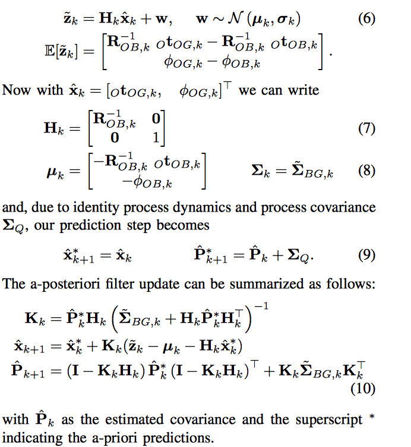
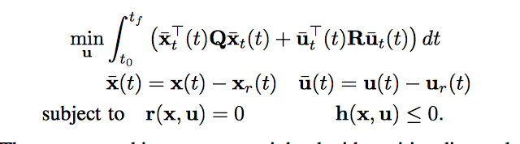

# Beauty and the Beast: Optimal Methods Meet Learning for Drone Racing

Approach drone navigation capable of fast adaptation to new tracks without precise knowleldge of track and copious amounts of training data.

A demonstration maps track to set of gates. At test time track configuration is estimated with a CNN and closest gate with uncertainty. This estimate is passed through an extended Kalman filter (EKF) to obtain maximum a-posteriori estimates of gate locations (helps account for high variance estimates resulting from obstructed gates). Model predictive control then navigates the MAV through the gate estimates.

Approach has 3 subsystems, perception, mapping, planning and control. Perception takes raw image from camera and estimates relative pose of next gate and uncertainty. Mapping takes pose estimates and quadrotor estimates and produces filtered estimates of gate poses. Planning uses gate poses to set waypoints through track which a controll pipeilne uses to generaate trajectories.

3 Frames, Odometry, Body, Gate. Odometry and Body frames are related through translation and rotation matrices (i.e every body position is represented by some rotation and traanslation in odometry frame). Relative gate positions to body are provided as a translation and rotation in odometry frame along with uncorrelated covariance of gate's position in body frame. Gate positions (in translation, rotation coordinates) are also kept in odometry frame.

Perception network taakes image, passes through CNN, and predicts mean and variance of multivariate normal distribution that represents next gate location. Mean is 4-vector and is spherical coordinates w.r.t body and tilt angle to represent relaltive horizontal orientation (measured between current heading of drone and current heading of gate).  

CNN and MLPz (multi-layer perceptron that estimates mean z) are trained to minimise L2 distance between groundtruth gate pose and the mean. MLP-variance is trained with fixed CNN paarameters, minimising negative log-likelihood of multivariate normal distribution with uncorrelated covariance. Training data is relative gate positions to body (camera is initiallised at known position relative to gate). Note, a single gate to collect data is feasible as it only tracks locations of body and gate.

Mapping takes gate estimates and corrects for CNN measurements and VIO (visual inertial odometry) drift. Done in 2 staages, measurement assignment and filter.

Measurement assignemnt takes the perception gate estimation (gate w.r.t body) and updates gate location in odometry frame. Done by assigning perception output to closest gate if closest gate is next gate to be passed. Next gate is tracked by detecting gate traversals using drone location in gate-based coordinate frame. This yields a map of all gates.

Filter transforms perception estimates to cartesian coordinates and expresses variance as a jacobian, and applies the EKF measurement to the traansformed meaan and variance to ge an updated map of the gates, summarized below.

Control and planning is done in 2 modules. One setting low-level waypoints and generating desired path, the other plans feasible control trajectories using predictive control.

2 Waypoints set for each gate, one in front and one immediately after.

Model preditive control sollves a quadratic optimization problem.

States x aand u aare weighted by positive diagonal matrices Q, R, and optimised to reference directions xr, ur.

Paper: [Beauty and the Beast: Optimal Methods Meet Learning for Drone Racing](https://arxiv.org/pdf/1810.06224.pdf). Paper was quite hard to understand and I don't have much experience with transforming between frames in a robotics scope. Had no clue what an EKF filter was too so I had to look up what it does.
