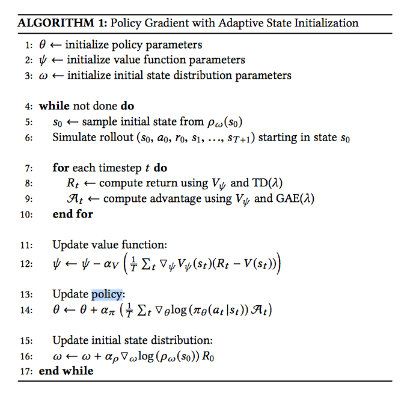

# SFV: Reinforcement Leaarning of Physical Skills from Videos

This paper outlines aan approach of developing character controllers from monocular video through pose estimation and deep reinforcement learning

Traditional controllers and animations derived from motion capture data is limited by the requirement of heavily controlled sensors and environments for actors. Using monocular videos (e.g YouTube) is more widespread but it is hard to extract useful information.

Pose estimation alone is insufficient as is sensitive to inconsistencies in estimates, and fails to account for physical limitaations. RL helps refine noisy pose estimates, compensates for missing frames, and accounts for environment and physical restraints making a more robust controller

Develop better motion reconstructions that are more amenable from monocular videos and novel reinforcement learning algorithm that uses adaptive state initialization dynamically updating initial state distribution to facillitate long-term horizon reward.

Inputs a reference video and simulated character model (character + environment). Extracts poses from videos through **Pose Estimation**, uses estimataes to calculate motion trajectory that adheres to 2D/3D pose estimates and temporal consisency between frames in **Motion Reconstruction** phase, trains character to imitate reference motion by learning a policy in the  **Motion imitation** phase through deep reinforcement learning.

Pose estimator is trained according to weakly supervised approach - i.e without a ground truth 3D labels. (not really sure what weakly supervised entails, will look up later).

Pose estimator combines OpenPose 2D joint location coordinates with HMR 3D pose (parametrized by joint angles and relative axis where root is pelvis). 3D pose is learned through a encoder-decoder network that transforms image to 3D pose with only 2D pose annotations.

RL model is trained to optimize a policy that imitates motion via motion imitation objective.

Pose estimator was trained on augmented data set of regular poses with additional rotated versions of poses on range [0, 2π]. Pose estimates are trained on static imaages of every frame in video, which are consolidated in motion reconstruction stage. Each pose contains joint information and 3D pose trajectory.

Motion reconstruction smooths poses and reconciles 2D and 3D pose predictions and enforces temporal consistency between frames. This is done by optimising a trajectory in the encoded space Z, where decoding this result would yield the desired trajectory. Optimisation involves minimising reconstruction loss which has 3 parts: 2D consistency loss which is the L1 norm across all joints and frames of the difference in 2D joint location and decoded joint locations of the current trajectory Z, q(z), adjusted for confidence, 3D consistency loss which is the distance between initial 3D prediction and current decoded 3D prediction of z, q(z), weighted by reprojection error (L2 norm of difference in 2D joint predictions and original 3D trajectory joint locations, ensuring poses initiaally consistent in 2D and 3D predictions are preserved), and finally a smoothness error which is the L2 norm (squared) across all frames of the decoded 3D pose of the current frame and the next frame.

After minimising loss, the final 3D trajectory is obtained by decoding the optimised encoded values, i.e q(z*)

Motion imitation is trained with PPO and augmented adaptive initiaal state distribution.

Initial state distribution is important as it exposes character to promising states likely to maximize reward reducing need for exploration. These states can be chosen by sampling trajectory although there is a high risk for jitters and undesired artifacts. 

Adaptive state initialisation is a multi-agent RL problem, one agent proposes starting state, the other controls the policy from that starting state onwards. The multi-agent objective is the expected discount reward across all trajectories specified by initial state agent. More specifically it is the integral over all trajectories of probability of starting in the state specified by the initial state agent, following a trajectory specified by policy agent multiplied by the discounted reward during the trajectory. The gradients can be used to train both agents (multi-agent objective, i.e gradient w.r.t each agent parameters). See Algorithm below.

Reward encourages character to imitate reference motion. It encourages matching of joint rotations, joint velocities, end-effector (i.e hands and feet) positions, and center of mass locations.

Motion completion is tested by starting the character in a new pose and simulating the policy learned for a motion with starting pose closest to the new pose.

State representation is identical to that in the [DeepLoco Paper]((https://github.com/jeffreytsaw/16881_Paper_Notes/blob/master/Low%20Level%20Skills/DeepLoco:%20Dynamic%20Locomotion%20Skills%20Using%20Hierarchical%20Deep%20Reinforcement%20Learning.md)

Actions are target rotations for PD controllers

Initial staate is represented by phase (indicates progression along motion) and state. Phase is a discrete distribution and has a corresponding mean and covariance matrix for each phase that represents the gaussian distribution of state given phase. Phase is sampled first and the corresponding mean and covariance is used to form a gaussian which is used to sample the initial state.

Paper: [SFV: Reinforcement Learning of Physical Skills from Videos](https://xbpeng.github.io/projects/SFV/2018_TOG_SFV.pdf) (probably my favourite so far the results are very impressive and the methodology is pretty cool).

